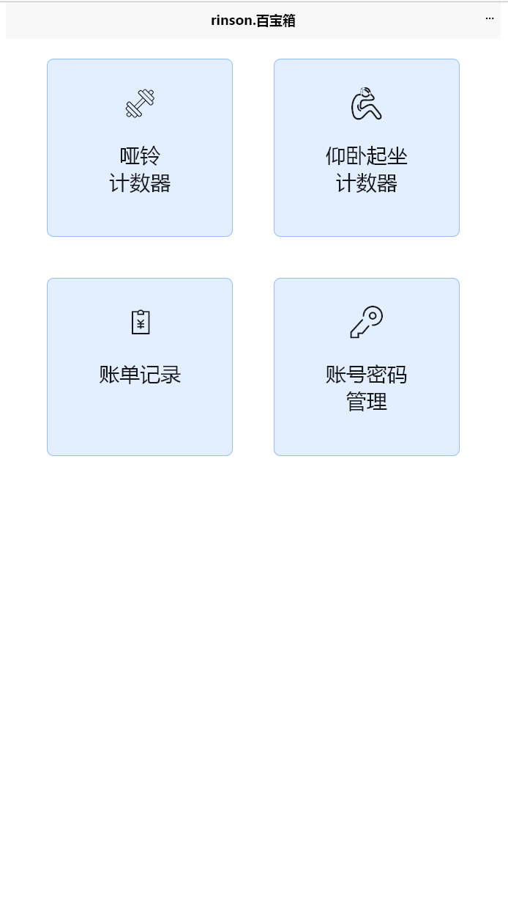

# rinson-toolbox
### rinson百宝箱

这是我自己写的小工具啦。纯自用，功能干净，无广告，无后端服务，不上传数据。（健身计数器配置使用本地缓存进行存储，账单数据使用本地配置文件进行保存）

账单工具，密码管理工具，只在APP端可用。(开发进行中)

> 小工具网页版：https://toolbox.rinson.me/#/
> 个人博客：https://rinson.me
> 用到的框架：[uni-app](https://uniapp.dcloud.net.cn/)
> 语音文件来自：[ttsmaker](https://ttsmaker.com/)
> github：https://github.com/XElengo/rinson-toobox
> github留言：https://github.com/XElengo/rinson-toobox/issues

#### 页面预览
##### 首页

  

  

##### 健身计数器

  

